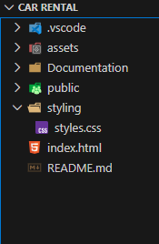

1. Project Title

Brand Website named: Car Rental

2. Description

A responsive  website built with HTML and CSS & PHP 
It showcases a simple mock up of a rental company's services, in a clean, accessible design.

3. Features

• Responsive design (mobile, tablet & desktop friendly)
• Accessible with proper semantic HTML and ARIA labels
• Sticky navigation bar and hamburger menu
• Custom branding and styling

4. Folder structure

5. Technologies Used:

- HTML5
- Modern CSS3 (Flexbox, Grid, Media Queries)
- PHP on the reservation form 

- Hex Colors from Adobe Palette Color:

  --bg-main: #faf0e5;
  --bg-secondary: #f8e7d5;
  --bg-card: #f3e0cf;

  --text-primary: #141311;
  --text-secondary: #4a4239;
  --text-muted: #7e756a;

  --accent-primary: #bd9c78;
  --accent-secondary: #c5baad;

6. Accessibility & Best Practices

This site follows accessibility best practices:

- Semantic HTML tags
- Proper alt attributes for images
- Language attribute set to `en-GB`

7. Deployment

Live Demo: https://armel-nzawou-developer.github.io/ArmelDesign/

8. License

- This website is not an open source but private.
- This website is licensed under ArmelDesign★ <https://armel-nzawou-developer.github.io/ArmelDesign/> .
